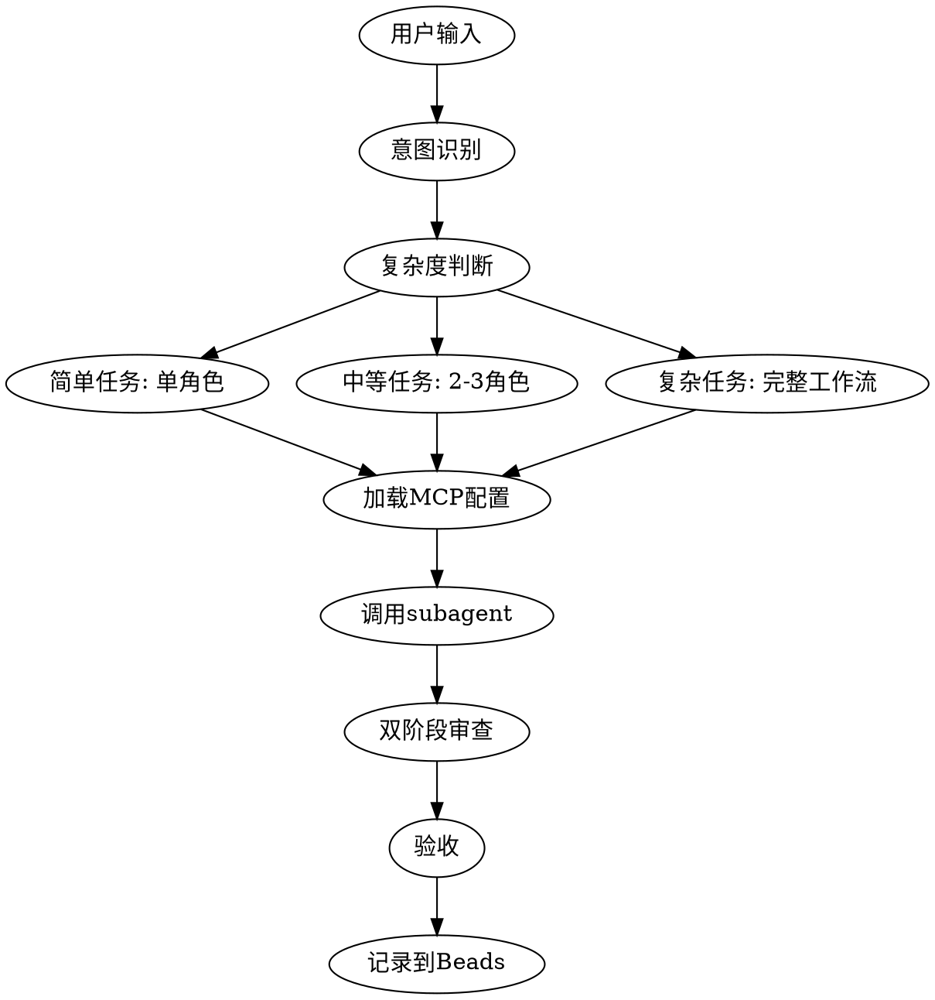

# 任务智能路由技能

## 触发条件

当用户消息包含以下关键词时自动激活:

### 开发类
- "开发"、"实现"、"添加"、"创建"、"构建"
- → 调用开发流程

### 设计类
- "设计"、"界面"、"UI"、"UX"、"原型"
- → 调用 UI/UX 设计师

### 架构类
- "架构"、"设计"、"技术选型"、"重构"
- → 调用架构师

### 问题类
- "bug"、"错误"、"问题"、"修复"
- → 调用 systematic-debugging 技能

### 测试类
- "测试"、"质量"、"覆盖率"
- → 调用测试工程师

### 审查类
- "审查"、"优化"、"检查"
- → 调用代码审查员

## 任务复杂度判断

### 简单任务 (单一角色)
- 特征: 单一功能,小改动
- 示例: "修复登录按钮样式"
- 流程: 单个 subagent → 验收

### 中等任务 (2-3 个角色)
- 特征: 涉及前后端或需要设计
- 示例: "添加用户头像功能"
- 流程: 架构师 → 开发工程师 → 测试工程师

### 复杂任务 (多角色协作)
- 特征: 新功能模块,系统级改动
- 示例: "开发支付系统"
- 流程: 完整工作流

## MCP 自动加载逻辑

对每个角色,自动:
1. 读取 `.claude-plugin/mcp-permissions.json`
2. 提取该角色的 MCP 配置
3. 注入到 subagent 提示词中
4. 强制执行必需 MCP 使用

### MCP 配置示例

```json
{
  "roles": {
    "product-manager": {
      "required_mcps": ["playwright"],
      "optional_mcps": ["context7"]
    },
    "developer": {
      "required_mcps": [],
      "optional_mcps": ["context7"]
    }
  }
}
```

## 防护机制

### 执行前
- [ ] 目标确认: 复述任务
- [ ] 边界声明: 明确范围
- [ ] 风险预判: 识别钻牛角尖点

### 执行中
- [ ] 进度同步: 每步报告状态
- [ ] 证据链: 所有断言附带文件路径
- [ ] 偏离检测: 超时自动触发暂停

### 紧急信号
- 连续 3 次失败
- 开始修改无关代码
- 超过 5 分钟无进展
- 技术术语堆砌但无实质进展

## 工作流程



## 使用示例

### 示例 1: 简单任务
用户: "修复登录按钮样式"
→ 识别为简单任务
→ 调用 developer (加载 context7 MCP)
→ 直接修复

### 示例 2: 中等任务
用户: "添加用户头像上传功能"
→ 识别为中等任务
→ 流程: UI/UX 设计师 → 开发工程师 → 测试工程师
→ 每个角色加载对应 MCP 配置

### 示例 3: 复杂任务
用户: "开发完整的支付系统"
→ 识别为复杂任务
→ 完整工作流: 产品经理 → 架构师 → 设计师 → 开发 → 测试 → 审查
→ 全程 MCP 自动管理

## 注意事项

1. **关键词匹配**: 使用模糊匹配,避免误触发
2. **复杂度判断**: 基于任务描述自动评估
3. **MCP 加载**: 读取配置并注入到 subagent 提示词
4. **防护机制**: 执行过程中持续监控
5. **紧急暂停**: 检测到偏离立即停止

## 配置文件位置

- MCP 权限配置: `.claude-plugin/mcp-permissions.json`
- Subagent 定义: `agents/AGENT.md`
- 工作流定义: `task-dispatcher/WORKFLOW.md`
