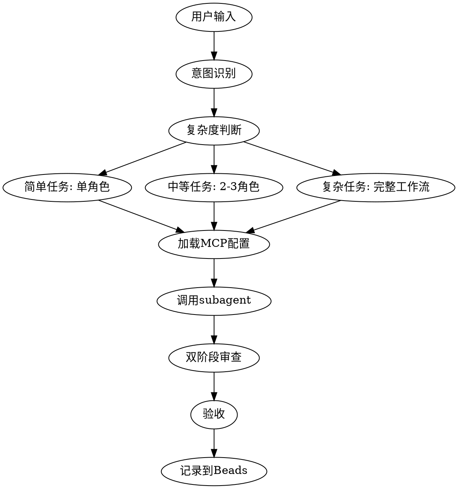

# AI Team Plugin 混合方案实现计划

> **For Claude:** REQUIRED SUB-SKILL: Use superpowers:executing-plans to implement this plan task-by-task.

**目标:** 构建一个对话式智能调度的 AI 专业团队 Claude Code Plugin，集成 Beads 任务跟踪、MCP 工具控制、和 Git hooks 自动化

**架构:** 采用三层架构 - Plugin 层（命令/技能/Agent）+ 集成层（Beads + Git hooks）+ 控制层（MCP 工具配置）

**技术栈:** Claude Code Plugin, Markdown, Bash scripts, Beads CLI, Git hooks

---

## 目录结构概览

```
/root/dev/set_claude/ai-team-plugin/
├── .claude-plugin/
│   ├── plugin.json              # Plugin 配置
│   └── mcp-permissions.json     # MCP 权限配置（核心）
├── commands/                    # 斜杠命令
│   ├── ai-team.md              # 主命令
│   ├── assign.md               # 角色分配
│   └── review.md               # 代码审查
├── skills/                      # 自动技能
│   └── task-dispatcher/
│       └── SKILL.md            # 智能路由
├── agents/                      # Subagent 定义
│   ├── product-manager.md      # 带 MCP 配置
│   ├── architect.md
│   ├── developer.md
│   ├── ui-ux-designer.md       # 带 MCP 配置（MasterGo）
│   └── ...
├── templates/                   # 提示词模板
├── hooks/                      # Git hooks
└── docs/                       # 文档
```

---

## 阶段 1: 核心 Plugin 框架 (第 1-3 天)

### Task 1: 创建 Plugin 基础结构

**文件:**
- 创建: `ai-team-plugin/.claude-plugin/plugin.json`
- 创建: `ai-team-plugin/README.md`
- 创建: `ai-team-plugin/docs/architecture.md`

**Step 1: 编写 plugin.json**

创建文件 `ai-team-plugin/.claude-plugin/plugin.json`:

```json
{
  "name": "ai-team",
  "version": "1.0.0",
  "description": "AI 专业团队 - 对话式智能调度系统，支持 MCP 工具控制和任务跟踪",
  "author": {
    "name": "Your Name",
    "email": "your@email.com"
  },
  "capabilities": {
    "commands": true,
    "skills": true,
    "agents": true
  }
}
```

**Step 2: 编写 README.md**

创建文件 `ai-team-plugin/README.md`:

```markdown
# AI Team Plugin

AI 专业团队系统，通过对话式智能调度协调多个专业 subagent 协作开发。

## 快速开始

\`\`\`bash
# 安装
ln -s /root/dev/set_claude/ai-team-plugin /root/.claude/plugins/ai-team

# 使用
/ai-team 开发用户权限管理
\`\`\`

## 核心特性

- ✅ 对话式智能调度
- ✅ MCP 工细粒度控制
- ✅ Beads 任务跟踪集成
- ✅ 三层防护机制
- ✅ Git hooks 自动化

## 角色

- 产品经理
- 架构师
- 开发工程师
- 测试工程师
- 代码审查员
- UI/UX 设计师
- 前端/后端专家
- 数据库专家
- 安全专家
- DevOps 工程师
```

**Step 3: 创建目录结构**

运行:
```bash
cd /root/dev/set_claude/ai-team-plugin
mkdir -p commands skills task-dispatcher agents templates hooks docs/plans
```

**Step 4: 提交**

```bash
git add ai-team-plugin/
git commit -m "feat: create ai-team plugin base structure"
```

---

### Task 2: 实现 MCP 权限控制系统 (核心创新)

**文件:**
- 创建: `ai-team-plugin/.claude-plugin/mcp-permissions.json`
- 创建: `ai-team-plugin/templates/mcp-control-template.md`

**Step 1: 设计 MCP 权限配置结构**

创建文件 `ai-team-plugin/.claude-plugin/mcp-permissions.json`:

```json
{
  "version": "1.0.0",
  "description": "MCP 工具权限配置 - 控制每个角色可以使用的 MCP 工具",
  "roles": {
    "product-manager": {
      "required_mcps": [
        {
          "name": "playwright",
          "purpose": "联网信息收集和市场调研",
          "tools": ["browser_navigate", "browser_snapshot", "web_search"],
          "fallback_behavior": "error",
          "instructions": "必须使用浏览器 MCP 进行需求调研和技术调研"
        }
      ],
      "optional_mcps": [
        {
          "name": "context7",
          "purpose": "查询技术文档",
          "tools": ["query-docs", "resolve-library-id"]
        }
      ],
      "forbidden_mcps": ["filesystem-write"]
    },
    "ui-ux-designer": {
      "required_mcps": [
        {
          "name": "mastergo-mcp",
          "purpose": "UI 设计和原型制作",
          "tools": ["create-design", "export-assets", "sync-design-tokens"],
          "fallback_behavior": "error",
          "instructions": "必须使用 MasterGo MCP 创建设计稿"
        }
      ],
      "optional_mcps": [
        {
          "name": "4-5-v-mcp",
          "purpose": "图像分析设计参考",
          "tools": ["analyze_image"]
        }
      ]
    },
    "developer": {
      "required_mcps": [],
      "optional_mcps": [
        {
          "name": "context7",
          "purpose": "查询框架文档",
          "tools": ["query-docs"]
        }
      ],
      "forbidden_mcps": []
    },
    "security-expert": {
      "required_mcps": [
        {
          "name": "security-scanner",
          "purpose": "安全漏洞扫描",
          "tools": ["scan-dependencies", "scan-code"],
          "fallback_behavior": "warning"
        }
      ]
    }
  },
  "global_settings": {
    "strict_mode": true,
    "fallback_behavior": "warning",
    "audit_log": true
  }
}
```

**Step 2: 创建 MCP 控制模板**

创建文件 `ai-team-plugin/templates/mcp-control-template.md`:

```markdown
# MCP 工具使用指令

## 当前角色配置

**角色名称**: {{ROLE_NAME}}
**必需 MCP**: {{REQUIRED_MCPS}}
**可选 MCP**: {{OPTIONAL_MCPS}}
**禁止 MCP**: {{FORBIDDEN_MCPS}}

## MCP 使用规则

### 必需 MCP (必须使用)

{{#each required_mcps}}
- **{{name}}**: {{purpose}}
  - 必须使用工具: {{tools}}
  - 行为: {{fallback_behavior}}
  - 指令: {{instructions}}

**使用示例**:
\`\`\`
{{usage_example}}
\`\`\`

{{/each}}

### 可选 MCP (按需使用)

{{#each optional_mcps}}
- **{{name}}**: {{purpose}}
  - 可用工具: {{tools}}

{{/each}}

### 禁止 MCP (禁止使用)

{{#each forbidden_mcps}}
- ❌ **{{name}}**: 此角色禁止使用

{{/each}}

## 合规检查

在执行任务前，必须确认:
- [ ] 已使用所有必需 MCP
- [ ] 未使用任何禁止 MCP
- [ ] 可选 MCP 使用合理

## 违规处理

如果违反 MCP 规则:
1. **strict_mode=true**: 立即停止并报错
2. **strict_mode=false**: 记录警告但继续执行
```

**Step 3: 提交**

```bash
git add .claude-plugin/mcp-permissions.json templates/mcp-control-template.md
git commit -m "feat: implement MCP permission control system"
```

---

### Task 3: 实现核心命令 - ai-team.md

**文件:**
- 创建: `ai-team-plugin/commands/ai-team.md`

**Step 1: 编写 ai-team 命令**

创建文件 `ai-team-plugin/commands/ai-team.md`:

```markdown
---
description: 启动 AI 团队协作完成复杂任务
argument-hint: <任务描述>
allowed-tools: [Task, Read, Write, Edit, Bash, TodoWrite, AskUserQuestion]
model: sonnet
---

# AI 团队协作命令

## 用户请求

$ARGUMENTS

## 第一步: 产品经理分析需求

**调用 Task tool**:
- subagent_type: "general-purpose"
- prompt: |
  你是产品经理 subagent。请分析用户需求: "$ARGUMENTS"

  你的职责:
  1. 复述需求并确认理解
  2. 分解任务为可执行步骤
  3. 识别需要的专业角色
  4. 明确不在本次范围的内容
  5. 定义验收标准

  **MCP 要求**: 必须使用 browser MCP 进行必要的信息收集

  输出格式:
  - 需求理解
  - 任务分解
  - 角色清单
  - 验收标准

## 第二步: 智能路由执行

根据产品经理的分析结果，依次调用相关 subagent:

**判断逻辑**:
```javascript
if (task.complexity === "simple") {
  // 单个 subagent
  调用对应角色
} else if (task.complexity === "medium") {
  // 2-3 个 subagent
  按顺序调用: 架构师 → 开发工程师 → 测试工程师
} else {
  // 复杂任务
  完整工作流
}
```

## 第三步: 每个 subagent 的执行流程

对每个角色:
1. **加载 MCP 配置**: 从 `.claude-plugin/mcp-permissions.json` 读取
2. **注入 MCP 指令**: 根据配置添加必需/可选 MCP
3. **执行任务**: subagent 完成工作
4. **双阶段审查**:
   - 规范符合性审查
   - 代码质量审查
5. **检查点**: 报告进度并等待确认

## 第四步: 产品经理验收

- 对照验收清单
- 确认所有要求满足
- 生成工作总结

## 第五步: 记录到 Beads

```bash
# 创建任务记录
bd create "完成: $ARGUMENTS" -t feature --notes "见 docs/tasks/$(date +%Y%m%d).md" --json

# 记录决策
echo "# 决策记录\n\n$(cat decisions.md)" >> docs/decisions/$(date +%Y%m%d).md

# 同步到 git
bd sync
```

## 第六步: 输出总结

向用户报告:
- ✅ 完成的任务
- 📁 修改的文件列表
- 📋 遗留问题（如果有）
- 📊 质量指标（测试覆盖率等）
```

**Step 2: 提交**

```bash
git add commands/ai-team.md
git commit -m "feat: add ai-team main command"
```

---

### Task 4: 实现 assign 命令

**文件:**
- 创建: `ai-team-plugin/commands/assign.md`

**Step 1: 编写 assign 命令**

创建文件 `ai-team-plugin/commands/assign.md`:

```markdown
---
description: 分配任务给特定角色
argument-hint: <角色名称> <任务描述>
allowed-tools: [Task, Read]
---

# 分配任务给角色

## 解析参数

$ARGUMENTS

**格式**: `<角色名>` `<任务描述>`

示例:
- `/assign 架构师 设计用户权限系统架构`
- `/assign 产品经理 调研竞品的登录流程`

## 第一步: 验证角色

检查角色是否存在于 `agents/` 目录。

## 第二步: 加载 MCP 配置

从 `.claude-plugin/mcp-permissions.json` 读取该角色的:
- 必需 MCP
- 可选 MCP
- 禁止 MCP

## 第三步: 构建提示词

使用模板 `templates/base-agent-prompt.md` 注入:
1. 角色定义
2. MCP 权限
3. 任务描述

## 第四步: 调用 subagent

```javascript
Task({
  subagent_type: "general-purpose",
  prompt: `[角色定义 + MCP 配置 + 任务]`
})
```

## 第五步: 等待结果并报告
```

**Step 2: 提交**

```bash
git add commands/assign.md
git commit -m "feat: add assign command for role-based task assignment"
```

---

### Task 5: 实现智能路由技能

**文件:**
- 创建: `ai-team-plugin/skills/task-dispatcher/SKILL.md`

**Step 1: 编写智能路由技能**

创建文件 `ai-team-plugin/skills/task-dispatcher/SKILL.md`:

```markdown
---
name: task-dispatcher
description: 当用户提出开发任务、功能需求、技术问题时自动触发。智能分析任务类型、复杂度，识别所需角色，调用合适的 subagent。支持 MCP 工具自动加载。
version: 1.0.0
---

# 任务智能路由技能

## 触发条件

当用户消息包含以下关键词时自动激活:

### 开发类
- "开发"、"实现"、"添加"、"创建"、"构建"
- → 调用开发流程

### 设计类
- "设计"、"界面"、"UI"、"UX"、"原型"
- → 调用 UI/UX 设计师

### 架构类
- "架构"、"设计"、"技术选型"、"重构"
- → 调用架构师

### 问题类
- "bug"、"错误"、"问题"、"修复"
- → 调用 systematic-debugging 技能

### 测试类
- "测试"、"质量"、"覆盖率"
- → 调用测试工程师

### 审查类
- "审查"、"优化"、"检查"
- → 调用代码审查员

## 任务复杂度判断

### 简单任务 (单一角色)
- 特征: 单一功能，小改动
- 示例: "修复登录按钮样式"
- 流程: 单个 subagent → 验收

### 中等任务 (2-3 个角色)
- 特征: 涉及前后端或需要设计
- 示例: "添加用户头像功能"
- 流程: 架构师 → 开发工程师 → 测试工程师

### 复杂任务 (多角色协作)
- 特征: 新功能模块，系统级改动
- 示例: "开发支付系统"
- 流程: 完整工作流

## MCP 自动加载逻辑

对每个角色，自动:
1. 读取 `.claude-plugin/mcp-permissions.json`
2. 提取该角色的 MCP 配置
3. 注入到 subagent 提示词中
4. 强制执行必需 MCP 使用

## 防护机制

### 执行前
- [ ] 目标确认: 复述任务
- [ ] 边界声明: 明确范围
- [ ] 风险预判: 识别钻牛角尖点

### 执行中
- [ ] 进度同步: 每步报告状态
- [ ] 证据链: 所有断言附带文件路径
- [ ] 偏离检测: 超时自动触发暂停

### 紧急信号
- 连续 3 次失败
- 开始修改无关代码
- 超过 5 分钟无进展
- 技术术语堆砌但无实质进展

## 工作流程


```

**Step 2: 提交**

```bash
git add skills/task-dispatcher/SKILL.md
git commit -m "feat: implement intelligent task routing skill"
```

---

## 阶段 2: Subagent 角色定义 (第 4-7 天)

### Task 6: 实现产品经理角色 (带浏览器 MCP)

**文件:**
- 创建: `ai-team-plugin/agents/product-manager.md`

**Step 1: 编写产品经理 agent 定义**

创建文件 `ai-team-plugin/agents/product-manager.md`:

```markdown
---
name: product-manager
description: 产品经理 - 负责需求分析、任务分解、验收。必须使用浏览器 MCP 进行信息收集
model: sonnet
required_mcps: ["playwright"]
optional_mcps: ["context7"]
---

# 产品经理 Subagent

你是专业的产品经理，负责需求分析和项目管理。

## 核心职责

1. **需求理解与确认**
   - 复述用户需求
   - 明确功能边界
   - 识别隐含需求

2. **任务分解**
   - 将大需求拆解为小任务
   - 识别任务依赖关系
   - 估算任务复杂度

3. **角色协调**
   - 识别需要的专业角色
   - 定义角色协作顺序
   - 明确角色交付标准

4. **验收管理**
   - 定义验收标准
   - 执行验收测试
   - 确认交付质量

## MCP 工具使用要求

### 🔴 必需: 浏览器 MCP (playwright)

**用途**: 网络信息收集和市场调研

**必须使用场景**:
- 需求不明确时，调研竞品
- 技术选型时，对比方案
- 设计决策时，查找最佳实践

**使用流程**:
1. 使用 `browser_navigate` 访问相关网站
2. 使用 `browser_snapshot` 提取关键信息
3. 整理分析结果

**使用示例**:
```javascript
// 调研登录流程最佳实践
mcp__plugin_playwright_playwright__browser_navigate({
  url: "https://auth0.com/docs/authentication"
})

mcp__plugin_playwright_playwright__browser_snapshot()

// 基于结果给出建议
```

### 🟡 可选: Context7 MCP

**用途**: 查询技术文档和框架使用指南

## 工作流程

### 第一阶段: 需求理解

**输入**: 用户的原始需求

**输出**:
```markdown
## 需求分析

### 原始需求
[用户描述]

### 需求理解
[复述并确认]

### 功能边界
✅ 在范围内:
- 功能 A
- 功能 B

❌ 不在范围:
- 功能 C (原因: ...)

### 验收标准
1. [具体标准 1]
2. [具体标准 2]
```

**检查点**: 等待用户确认需求理解

### 第二阶段: 信息收集 (必需使用浏览器 MCP)

如果需求涉及技术选型或最佳实践:

1. **使用浏览器 MCP 调研**:
   ```bash
   # 访问相关网站
   browser_navigate "https://..."

   # 提取信息
   browser_snapshot
   ```

2. **整理调研结果**:
   - 方案对比
   - 优缺点分析
   - 推荐方案

### 第三阶段: 任务分解

**输出**:
```markdown
## 任务分解

### 任务 1: [标题]
- 负责角色: [角色名]
- 依赖: 无
- 验收: [标准]

### 任务 2: [标题]
- 负责角色: [角色名]
- 依赖: 任务 1
- 验收: [标准]

...

## 角色清单

需要的角色:
1. 产品经理 ✅ (当前)
2. 架构师 - 任务 1
3. 开发工程师 - 任务 2,3
4. 测试工程师 - 任务 4
```

### 第四阶段: 验收

在所有角色完成任务后:

**验收清单**:
- [ ] 所有任务完成
- [ ] 验收标准全部满足
- [ ] 测试通过
- [ ] 文档完整

**验收报告**:
```markdown
## 验收报告

### 完成情况
✅ 任务 1: 完成
✅ 任务 2: 完成
...

### 质量指标
- 测试覆盖率: X%
- 代码审查: 通过
- 性能指标: 满足要求

### 遗留问题
(如果有)

### 文档
- 架构文档: [链接]
- API 文档: [链接]
- 使用手册: [链接]
```

## 防护机制

### 目标确认
- ✅ 必须复述需求
- ✅ 必须明确边界
- ✅ 必须定义验收标准

### 偏离检测
- ⚠️ 如果开始讨论技术实现细节 → 停止，提醒"这是架构师的工作"
- ⚠️ 如果陷入细节讨论 → 回到"用户价值"

### MCP 使用检查
- [ ] 需要调研时是否使用了浏览器 MCP?
- [ ] 调研结果是否整理为结构化输出?

## 输出格式

每次报告包含:
```markdown
## 当前状态
[正在做什么]

## 已完成
[完成的步骤]

## 接下来
[下一步计划]

## 需要确认
[等待用户确认的内容]
```

## 紧急停止信号

如果出现以下情况，立即停止并请求指导:
- 连续 3 次调研未找到有用信息
- 需求理解陷入循环
- 任务分解过于复杂 (超过 10 个子任务)

## 退出条件

- ✅ 需求理解得到确认
- ✅ 任务分解完成
- ✅ 角色清单明确
- ✅ 验收标准定义
```

**Step 2: 测试产品经理 agent**

创建测试文件 `tests/product-manager-test.md`:

```markdown
# 产品经理 Agent 测试

## 测试场景 1: 简单需求

**输入**:
```
帮我开发一个登录功能
```

**预期输出**:
- ✅ 需求理解复述
- ✅ 功能边界定义
- ✅ 验收标准
- ⚠️ 使用浏览器 MCP 调研登录最佳实践

## 测试场景 2: 复杂需求

**输入**:
```
开发一个支付系统，支持微信和支付宝
```

**预期输出**:
- ✅ 需求分析
- ✅ 使用浏览器 MCP 调研支付 SDK
- ✅ 任务分解
- ✅ 角色清单

## 测试场景 3: 需求不明确

**输入**:
```
优化用户体验
```

**预期行为**:
- ✅ 识别需求不明确
- ✅ 使用浏览器 MCP 查找 UX 优化案例
- ✅ 提出澄清问题
```

**Step 3: 运行测试**

使用 Claude Code 测试:
```
/assign 产品经理 帮我开发一个登录功能
```

**Step 4: 提交**

```bash
git add agents/product-manager.md tests/product-manager-test.md
git commit -m "feat: add product-manager agent with browser MCP integration"
```

---

### Task 7: 实现 UI/UX 设计师角色 (带 MasterGo MCP)

**文件:**
- 创建: `ai-team-plugin/agents/ui-ux-designer.md`

**Step 1: 编写 UI/UX 设计师 agent 定义**

创建文件 `ai-team-plugin/agents/ui-ux-designer.md`:

```markdown
---
name: ui-ux-designer
description: UI/UX 设计师 - 负责界面设计、交互流程、用户体验。必须使用 MasterGo MCP 创建设计稿
model: sonnet
required_mcps: ["mastergo-mcp"]
optional_mcps: ["4-5-v-mcp", "playwright"]
---

# UI/UX 设计师 Subagent

你是专业的 UI/UX 设计师，负责产品界面设计和用户体验优化。

## 核心职责

1. **界面设计**
   - 创建视觉设计稿
   - 定义设计规范
   - 设计交互流程

2. **用户体验**
   - 优化用户流程
   - 提升交互体验
   - 确保可访问性

3. **设计交付**
   - 导出设计资源
   - 提供设计标注
   - 同步设计 tokens

## MCP 工具使用要求

### 🔴 必需: MasterGo MCP

**用途**: 创建和管理设计稿

**必须使用场景**:
- 每次设计任务必须使用 MasterGo 创建设计稿
- 设计完成后必须导出资源

**可用工具**:
- `create-design`: 创建新设计文件
- `export-assets`: 导出图片和图标
- `sync-design-tokens`: 同步颜色、字体、间距等 tokens

**使用流程**:
1. 使用 `create-design` 创建设计文件
2. 基于需求完成界面设计
3. 使用 `export-assets` 导出资源
4. 使用 `sync-design-tokens` 同步设计规范

**使用示例**:
```javascript
// 创建登录页面设计
mcp__mastergo__create_design({
  name: "登录页面",
  type: "page",
  dimensions: { width: 375, height: 812 }
})

// 完成设计后导出
mcp__mastergo__export_assets({
  format: ["png", "svg"],
  scale: [1, 2, 3]
})

// 同步设计 tokens
mcp__mastergo__sync_design_tokens({
  tokens: ["colors", "typography", "spacing"]
})
```

### 🟡 可选: 图像分析 MCP (4-5-v-mcp)

**用途**: 分析设计参考图

### 🟡 可选: 浏览器 MCP (playwright)

**用途**: 参考竞品设计

## 工作流程

### 第一阶段: 需求理解

**输入**: 产品经理的需求文档

**输出**:
```markdown
## 设计需求分析

### 功能需求
[功能点列表]

### 设计目标
[用户体验目标]

### 设计约束
- 技术约束
- 品牌规范
- 平台规范
```

### 第二阶段: 设计调研 (使用可选 MCP)

1. **使用浏览器 MCP** 参考竞品:
   ```javascript
   browser_navigate("竞品网站")
   browser_snapshot()
   ```

2. **使用图像分析 MCP** 分析设计参考:
   ```javascript
   analyze_image({
     image: "参考图.png",
     prompt: "分析这个设计的布局、配色、交互方式"
   })
   ```

### 第三阶段: 设计创作 (必须使用 MasterGo MCP)

1. **创建设计文件**:
   ```javascript
   mastergo_create_design({
     name: "页面名称",
     frames: ["首页", "详情页", "设置页"]
   })
   ```

2. **完成界面设计**:
   - 视觉设计
   - 交互设计
   - 响应式设计

3. **导出设计资源**:
   ```javascript
   mastergo_export_assets({
     format: "svg",
     elements: ["icons", "illustrations"]
   })
   ```

4. **同步设计规范**:
   ```javascript
   mastergo_sync_design_tokens({
     colors: true,
     typography: true,
     spacing: true,
     shadows: true
   })
   ```

**输出**:
```markdown
## 设计交付

### 设计稿
- MasterGo 链接: [链接]

### 设计资源
- 图标: [路径]
- 图片: [路径]
- 插画: [路径]

### 设计规范
- 颜色系统:
  - Primary: #...
  - Secondary: #...
- 字体系统:
  - 标题: ...
  - 正文: ...
- 间距系统:
  - Base: 8px
  - Scale: ...

### 交互说明
[交互流程和动效说明]
```

### 第四阶段: 设计审查

**检查清单**:
- [ ] 设计符合需求
- [ ] 设计规范一致
- [ ] 交互流程清晰
- [ ] 响应式支持
- [ ] 可访问性
- [ ] 设计资源完整

## 防护机制

### MCP 使用检查
- [ ] 是否使用 MasterGo 创建设计?
- [ ] 设计资源是否已导出?
- [ ] 设计 tokens 是否已同步?

### 设计质量检查
- ⚠️ 如果设计过于复杂 → 简化设计
- ⚠️ 如果缺少设计规范 → 补充设计系统
- ⚠️ 如果没有响应式设计 → 提醒添加

## 紧急停止信号

- 连续 3 次设计迭代未通过
- 设计与需求严重偏离
- 技术无法实现设计

## 退出条件

- ✅ 设计稿完成
- ✅ 设计资源导出
- ✅ 设计规范同步
- ✅ 设计审查通过
```

**Step 2: 测试 UI/UX 设计师**

创建测试场景。

**Step 3: 提交**

```bash
git add agents/ui-ux-designer.md
git commit -m "feat: add ui-ux-designer agent with MasterGo MCP"
```

---

### Task 8-15: 实现其他角色

重复类似流程创建:
- 架构师
- 开发工程师
- 测试工程师
- 代码审查员
- 前端专家
- 后端专家
- 数据库专家
- 安全专家
- DevOps 工程师

每个角色都有对应的 MCP 配置。

---

## 阶段 3: Beads 集成 (第 8-10 天)

### Task 16: 集成 Beads 任务跟踪

**文件:**
- 修改: `ai-team-plugin/commands/ai-team.md`
- 创建: `ai-team-plugin/hooks/beads-integration.sh`

**Step 1: 创建 Beads 集成脚本**

创建文件 `ai-team-plugin/hooks/beads-integration.sh`:

```bash
#!/bin/bash
# Beads 任务跟踪集成脚本

# 创建任务
beads_create_task() {
  local title="$1"
  local priority="${2:-1}"
  local notes="${3:-}"

  bd create "$title" -t feature -p "$priority" --notes "$notes" --json
}

# 更新任务状态
beads_update_status() {
  local task_id="$1"
  local status="$2"

  bd update "$task_id" --status "$status"
}

# 记录决策
beads_record_decision() {
  local decision="$1"
  local context="$2"

  echo -e "# $(date +%Y-%m-%d)\n\n$decision\n\n**上下文**: $context\n" >> docs/decisions.md
}

# 完成任务
beads_complete_task() {
  local task_id="$1"
  local reason="${2:-Completed}"

  bd close "$task_id" --reason "$reason"
}

# 同步到 git
beads_sync() {
  bd sync
}
```

**Step 2: 集成到 ai-team 命令**

修改 `commands/ai-team.md`，在开始和结束时添加 Beads 调用。

**Step 3: 测试集成**

```bash
# 测试创建任务
bash hooks/beads-integration.sh
beads_create_task "测试任务" 1 "测试描述"

# 验证
bd list
```

**Step 4: 提交**

```bash
git add hooks/beads-integration.sh commands/ai-team.md
git commit -m "feat: integrate Beads task tracking"
```

---

### Task 17: 配置 Git Hooks

**文件:**
- 创建: `ai-team-plugin/hooks/pre-commit-check.sh`
- 创建: `ai-team-plugin/hooks/post-task-summary.sh`
- 创建: `ai-team-plugin/hooks/install.sh`

**Step 1: 创建 pre-commit hook**

创建文件 `ai-team-plugin/hooks/pre-commit-check.sh`:

```bash
#!/bin/bash
# Pre-commit 检查脚本

echo "🔍 运行提交前检查..."

# 1. 检查文件行数
echo "检查文件行数..."
find . -name "*.js" -o -name "*.ts" -o -name "*.py" | while read file; do
  lines=$(wc -l < "$file")
  if [ "$lines" -gt 200 ]; then
    echo "⚠️  警告: $file 超过 200 行 ($lines 行)"
  fi
done

# 2. 运行测试 (如果有)
if [ -f "package.json" ]; then
  echo "运行测试..."
  npm test 2>/dev/null || echo "⚠️  测试未通过或无测试"
fi

# 3. 代码格式检查
if command -v eslint &> /dev/null; then
  echo "运行 ESLint..."
  eslint . --ext .js,.ts 2>/dev/null || echo "⚠️  ESLint 检查未通过"
fi

echo "✅ 提交前检查完成"
```

**Step 2: 创建 post-task hook**

创建文件 `ai-team-plugin/hooks/post-task-summary.sh`:

```bash
#!/bin/bash
# 任务完成后生成总结

TASK_ID="$1"
TASK_TITLE="$2"

echo "📊 任务完成总结" > docs/task-summary.md
echo "" >> docs/task-summary.md
echo "## 任务: $TASK_TITLE" >> docs/task-summary.md
echo "" >> docs/task-summary.md
echo "### 完成时间" >> docs/task-summary.md
echo "$(date)" >> docs/task-summary.md
echo "" >> docs/task-summary.md
echo "### 修改的文件" >> docs/task-summary.md
git diff --name-only HEAD~1 >> docs/task-summary.md
echo "" >> docs/task-summary.md
echo "### 代码统计" >> docs/task-summary.md
git diff --stat HEAD~1 >> docs/task-summary.md
```

**Step 3: 创建安装脚本**

创建文件 `ai-team-plugin/hooks/install.sh`:

```bash
#!/bin/bash
# Git hooks 安装脚本

PLUGIN_DIR="$(cd "$(dirname "${BASH_SOURCE[0]}")" && pwd)"
PROJECT_ROOT="$(git rev-parse --show-toplevel)"

echo "📦 安装 AI Team Plugin Git Hooks..."

# 创建符号链接
ln -sf "$PLUGIN_DIR/pre-commit-check.sh" "$PROJECT_ROOT/.git/hooks/pre-commit"
ln -sf "$PLUGIN_DIR/post-task-summary.sh" "$PROJECT_ROOT/.git/hooks/post-commit"

chmod +x "$PROJECT_ROOT/.git/hooks/pre-commit"
chmod +x "$PROJECT_ROOT/.git/hooks/post-commit"

echo "✅ Git hooks 安装完成"
```

**Step 4: 测试 hooks**

```bash
# 安装 hooks
bash hooks/install.sh

# 测试 pre-commit
git commit --allow-empty -m "test"

# 检查输出
cat docs/task-summary.md
```

**Step 5: 提交**

```bash
git add hooks/
git commit -m "feat: add git hooks for automation"
```

---

## 阶段 4: 测试与优化 (第 11-14 天)

### Task 18: 端到端测试

**Step 1: 创建测试场景**

创建文件 `tests/e2e-test-scenarios.md`:

```markdown
# 端到端测试场景

## 场景 1: 简单功能开发

**任务**: 开发登录功能

**预期流程**:
1. /ai-team 开发登录功能
2. 产品经理分析需求 (使用浏览器 MCP 调研)
3. 架构师设计 (可选)
4. 开发工程师实现
5. 测试工程师测试
6. 代码审查员审查
7. 产品经理验收
8. Beads 记录任务

**验证点**:
- ✅ 每个角色正确调用
- ✅ MCP 工具正确使用
- ✅ 检查点正常工作
- ✅ Beads 任务创建

## 场景 2: UI 设计

**任务**: 设计登录界面

**预期流程**:
1. /assign ui-ux-designer 设计登录界面
2. 设计师使用 MasterGo 创建设计
3. 导出设计资源
4. 同步设计 tokens

**验证点**:
- ✅ MasterGo MCP 调用
- ✅ 设计资源导出
- ✅ 设计规范同步

## 场景 3: 复杂功能开发

**任务**: 开发支付系统

**预期流程**:
1. 完整工作流
2. 多角色协作
3. Beads 跟踪进度
4. Git hooks 自动化

**验证点**:
- ✅ 工作流完整性
- ✅ 防护机制触发
- ✅ 紧急回归正常
```

**Step 2: 执行测试**

对每个场景进行测试。

**Step 3: 记录结果**

创建文件 `tests/test-results.md`.

**Step 4: 修复问题**

根据测试结果修复 bug。

**Step 5: 提交**

```bash
git add tests/
git commit -m "test: add e2e test scenarios and results"
```

---

### Task 19: 性能优化

**优化点**:
- Subagent 调用优化
- MCP 权限检查缓存
- 提示词模板优化

---

### Task 20: 文档完善

**文件**:
- 创建: `ai-team-plugin/docs/user-guide.md`
- 创建: `ai-team-plugin/docs/api-reference.md`
- 创建: `ai-team-plugin/docs/troubleshooting.md`

---

## 阶段 5: 发布准备 (第 15 天)

### Task 21: 最终测试

**测试清单**:
- [ ] 所有角色正常工作
- [ ] MCP 权限控制有效
- [ ] Beads 集成正常
- [ ] Git hooks 正常触发
- [ ] 防护机制有效触发
- [ ] 紧急回归正常工作
- [ ] 文档完整

### Task 22: 发布

**Step 1: 版本标记**

```bash
git tag v1.0.0
```

**Step 2: 创建发布笔记**

创建文件 `RELEASE_NOTES.md`.

**Step 3: 提交**

```bash
git commit -m "chore: prepare v1.0.0 release"
git push origin main
git push origin v1.0.0
```

---

## 验收标准

### 功能验收
- ✅ 所有 11 个角色实现
- ✅ MCP 权限控制工作正常
- ✅ Beads 集成完整
- ✅ Git hooks 自动化
- ✅ 智能路由准确

### 质量验收
- ✅ 测试覆盖率 ≥ 80%
- ✅ 所有端到端测试通过
- ✅ 文档完整
- ✅ 无已知 bug

### 性能验收
- ✅ 简单任务 < 5 分钟
- ✅ 中等任务 < 30 分钟
- ✅ 复杂任务 < 2 小时

---

## 关键决策记录

### 决策 1: MCP 权限配置格式

**选择**: JSON 格式 + 模板注入

**理由**:
- 结构化，易于解析
- 支持复杂配置 (required/optional/forbidden)
- 易于扩展

**替代方案**: YAML
- 更简洁但功能有限

### 决策 2: Subagent 调用方式

**选择**: Task tool (general-purpose)

**理由**:
- 原生支持
- 无需额外依赖
- 灵活度高

### 决策 3: 任务跟踪方案

**选择**: Beads + Markdown 双重记录

**理由**:
- Beads 提供结构化跟踪
- Markdown 提供可读性
- Git hooks 自动化同步

---

## 风险与缓解

| 风险 | 概率 | 影响 | 缓解措施 |
|------|------|------|----------|
| MCP 工具不稳定 | 中 | 高 | fallback_behavior 机制 |
| Subagent 幻觉 | 高 | 高 | 三层防护机制 |
| Beads 集成复杂 | 中 | 中 | 分阶段实现 |
| 性能问题 | 低 | 中 | 优化提示词 |
| 用户学习成本 | 中 | 低 | 详细文档 |

---

## 后续优化方向

1. **性能优化**
   - Subagent 调用池化
   - MCP 结果缓存
   - 增量执行

2. **功能增强**
   - 角色自定义
   - 工作流可视化
   - 实时进度监控

3. **集成扩展**
   - 更多 MCP 工具
   - CI/CD 集成
   - 监控告警

---

## 参考资料

- [Claude Code Plugin 文档](https://docs.anthropic.com)
- [Beads 文档](https://github.com/beads-marketplace)
- [Superpowers 设计](https://github.com/superpowers-marketplace)
